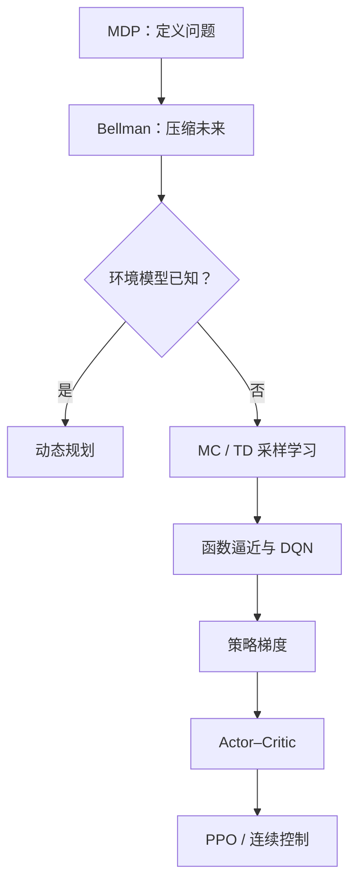
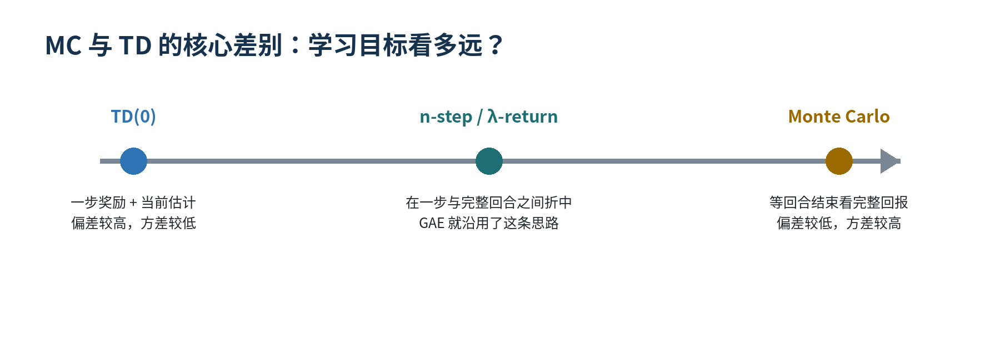

# Reinforcement Learning notebook

> 一份问题驱动的强化学习学习仓库：不从算法名字开始背，而是追问每个算法究竟解决了上一种方法的什么局限！


## 建立这个仓库的目的

我希望能够展示的不只是“学过哪些强化学习算法”，而是我能否：

- 从问题出发，解释算法为什么出现；
- 从直觉走到公式，再把公式映射到训练代码；
- 区分容易混淆但会直接影响实现的概念；
- 把课程理论用于机器人强化学习、模仿学习与训练诊断。

**English summary:** A problem-driven study repository connecting MDPs, Bellman equations, Monte Carlo, TD learning, function approximation, policy gradients, Actor–Critic, and PPO to practical robotics training.

## 我的统一理解框架

我发现，大多数的强化学习算法都能用五个问题拆解：

1. **数据从哪里来？** 来自模型计算、当前策略采样，还是旧策略/经验回放？
2. **学习目标是什么？** 完整回报、一步 TD target、n-step return，还是 advantage？
3. **是否自举？** 目标是否使用当前价值估计？
4. **怎样表示知识？** 表格、线性函数、价值网络，还是显式策略网络？
5. **怎样改进策略？** greedy、ε-greedy、policy gradient，还是受约束的概率比率更新？



## 我认为最重要的六点思考

### 1. Bellman 方程是“时间压缩接口”

它真正重要的地方，不是把一个长公式写得更短，而是把无限未来压缩为：

> 一步奖励 + 下一状态的价值。

这使长期决策问题能够通过局部更新求解，也解释了动态规划、TD、DQN 与 critic 为什么共享相似的 target 结构。

### 2. 固定点方程与学习算法不是同一件事

- `v = f(v)` 描述最终答案必须满足的自洽条件；
- `vₖ₊₁ = f(vₖ)` 描述寻找这个答案的迭代过程。

这个区分帮助我理解：公式给出“什么是正确”，算法解决“怎样逐步到达正确”。

### 3. MC 与 TD 不是两座孤岛，而是一条连续谱

MC 等待完整回报，TD(0) 只看一步，n-step、λ-return 和 GAE 位于二者之间。它们本质上在调节同一个取舍：

> 学习目标看得越远，通常偏差越低、方差越高；看得越近则相反。



### 4. Actor–Critic 是两条算法路线的汇合点

Actor 解决“怎样行动”，Critic 解决“这次行动比预期好多少”。Critic 不是奖励来源，而是把短期奖励转换成长时序学习信号的估计器。

当 `V` 足够准确时，一步 TD error 的条件期望就是 Advantage。这解释了为什么同一个 `δ` 能同时训练 actor 和 critic。

### 5. PPO 的稳定性可以追溯到前面的课程

PPO 并不是孤立的新算法：

- TD error 提供局部学习信号；
- GAE 在 MC 与 TD 之间折中；
- Actor–Critic 同时学习策略和价值；
- clipping 限制一次更新的策略变化幅度。

因此我把 PPO 理解为：**低方差优势估计 + 受限制的策略改进**。

### 6. 奖励工程是在定义任务，不是在修改算法

改变奖励权重、阈值和终止条件，实际改变的是 MDP 中的 `R` 与 episode 边界。训练曲线变好不一定意味着任务完成得更好，还必须回放策略并检查每个 reward term 是否与真实目标一致。

## 内容导航

| 模块 | 核心问题 | 笔记 |
|---|---|---|
| 学习地图 | 十章课程怎样形成一条主线？ | [00 · Learning Map](notes/00-learning-map.md) |
| MDP 与 Bellman | 为什么长期回报能写成一步递推？ | [01 · MDP and Bellman](notes/01-mdp-and-bellman.md) |
| DP / MC / TD | 模型、完整回报和自举各有什么代价？ | [02 · DP, MC and TD](notes/02-dp-mc-td.md) |
| 函数逼近与 DQN | 状态太多时怎样泛化，为什么会不稳定？ | [03 · Function Approximation](notes/03-function-approximation-dqn.md) |
| 策略梯度与 AC | 为什么可以直接优化动作概率？ | [04 · Policy Gradient and AC](notes/04-policy-gradient-actor-critic.md) |
| PPO 与机器人实践 | 课程公式怎样映射到训练配置和日志？ | [05 · PPO and Robotics](notes/05-ppo-and-robotics.md) |
| 易混淆概念 | V/Q/A、on/off-policy、MC/TD 如何快速区分？ | [06 · Misconceptions](notes/06-common-misconceptions.md) |

## 从公式到代码：我会怎样阅读一个训练项目

| 数学对象 | 代码中的常见位置 | 我会检查的问题 |
|---|---|---|
| 状态 `S` | observations / state buffer | 信息是否足够？量纲和归一化是否合理？ |
| 动作 `A` | policy output / action scale | 是否饱和、抖动或幅度不足？ |
| 奖励 `R` | reward terms / weights | 分量是否冲突？是否存在奖励投机？ |
| 回报与优势 | returns / advantages / GAE | bootstrap 与时间截断是否处理正确？ |
| 策略更新 | actor loss / ratio / clip | KL、clip fraction 是否过大？ |
| 价值学习 | critic / value loss | critic 是否跟得上策略变化？ |

## 机器人强化学习实践连接

我正在把这套理论框架用于以下类型的任务：

- Isaac Lab 并行环境中的 PPO 训练与 TensorBoard 诊断；
- xMimic 动作跟踪任务中的奖励权重、阈值与 checkpoint 分析；
- 灵巧手与机器人连续控制任务中的状态、动作和奖励建模；
- 从 UniDexGrasp / PPO 代码中定位 rollout、storage、actor、critic 与 loss。

实践记录不会只写“参数从多少改到多少”，而会解释该参数对应 MDP 或优化过程中的哪个对象，以及为什么预期它会影响结果。

## 快速浏览入口

- 知识结构：[课程知识地图](notes/00-learning-map.md)
- 公式理解：[Bellman 固定点与迭代](notes/01-mdp-and-bellman.md)
- 算法比较：[MC、TD、Sarsa 与 Q-learning](notes/02-dp-mc-td.md)
- 工程连接：[PPO 与 Isaac Lab](notes/05-ppo-and-robotics.md)
- 自我检验：[20 个核心问题](interview/20-questions.md)
- 下载完整手册：[Word 版学习手册](docs/reinforcement-learning-handbook-zh.docx)

## 仓库结构

```text
.
├── README.md
├── PROJECT_LOG.md
├── ROADMAP.md
├── notes/
│   ├── 00-learning-map.md
│   ├── 01-mdp-and-bellman.md
│   ├── 02-dp-mc-td.md
│   ├── 03-function-approximation-dqn.md
│   ├── 04-policy-gradient-actor-critic.md
│   ├── 05-ppo-and-robotics.md
│   └── 06-common-misconceptions.md
├── interview/20-questions.md
├── docs/
│   └── reinforcement-learning-handbook-zh.docx
└── assets/
    ├── learning-map.png
    └── mc-td-spectrum.png
```

## 当前状态

- [x] 完成从 MDP 到 Actor–Critic 的课程知识主线
- [x] 补充 PPO / GAE 与机器人训练的连接
- [x] 整理易混概念、公式速查与自测问题
- [ ] 为每类核心算法增加最小可运行实验
- [ ] 加入 Isaac Lab / xMimic 实验曲线与消融分析

> 这是一份持续更新的学习记录。目标不是展示“我已经知道所有答案”，而是展示我如何提出正确的问题、建立可迁移的理解，并用实验验证判断。
