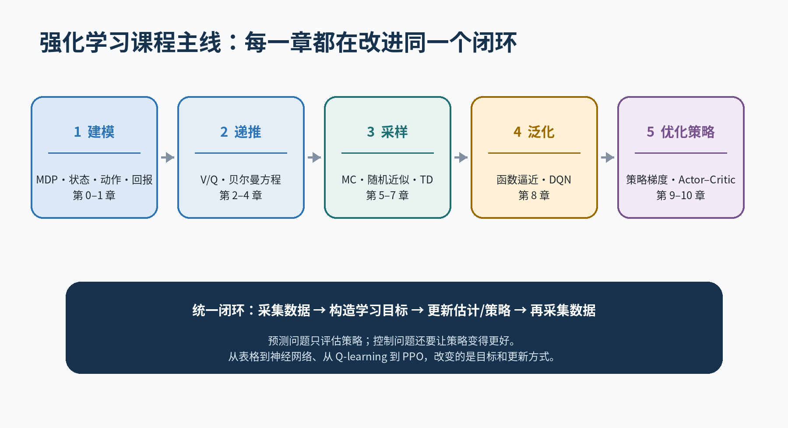

# 00 · Reinforcement Learning Learning Map

## 一条主线

强化学习始终在循环做两件事：

1. **评估**：当前策略的长期表现怎样？
2. **改进**：怎样利用评估结果得到更好的策略？

## 课程的五个阶段

### 1. 问题建模：MDP

先明确状态、动作、奖励、转移和折扣。若状态不是马尔可夫的，后面再复杂的算法也可能只是在错误的信息上优化。

### 2. 价值递推：Bellman 与动态规划

价值函数把未来压缩成一个数，Bellman 方程把长期回报变成一步递推。模型已知时，可以用 Policy Iteration 或 Value Iteration 求固定点。

### 3. 样本学习：MC、随机近似与 TD

模型未知时，用样本代替精确期望。MC 使用完整回报，TD 使用 bootstrap target，随机近似解释带噪更新为何仍可能收敛。

### 4. 泛化：函数逼近与 DQN

状态空间太大时，用参数共享实现泛化。代价是稳定性问题：一个样本会同时改变许多状态的估计。

### 5. 直接优化策略：Policy Gradient 与 Actor–Critic

连续动作下无法逐个枚举动作取 `max`，因此直接学习策略。Actor–Critic 用价值估计降低策略梯度方差，PPO 再限制单次更新幅度。

## 阅读新算法时的五维坐标

| 维度 | 可选答案示例 |
|---|---|
| 数据来源 | 模型、on-policy rollout、off-policy replay |
| target | return、TD target、n-step、advantage |
| bootstrap | 是 / 否 |
| 表示方式 | table、linear、Q network、actor + critic |
| 策略改进 | greedy、ε-greedy、policy gradient、clipped update |

新算法通常不是完全重建体系，而是在这些维度上选择了新的组合。
